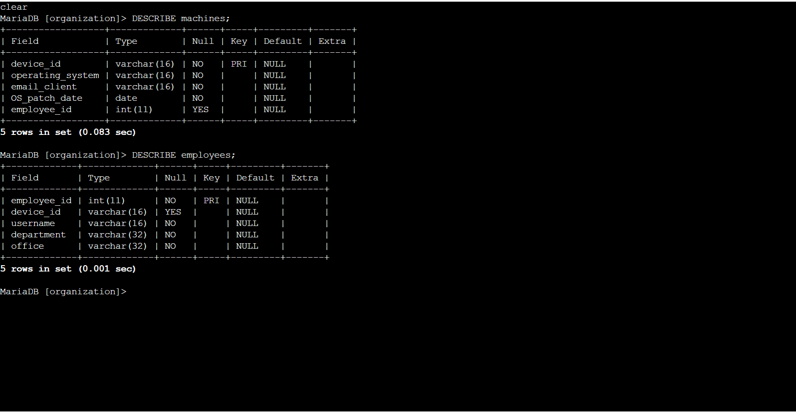
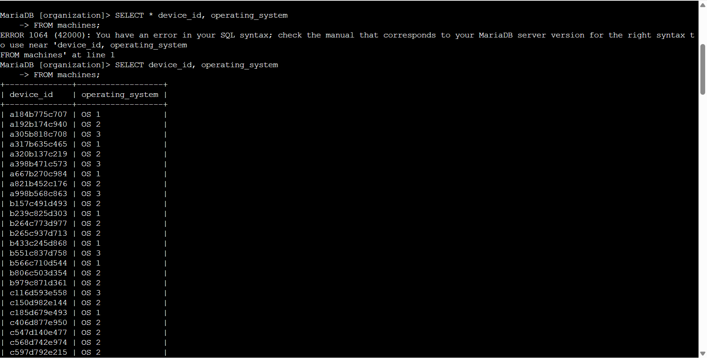
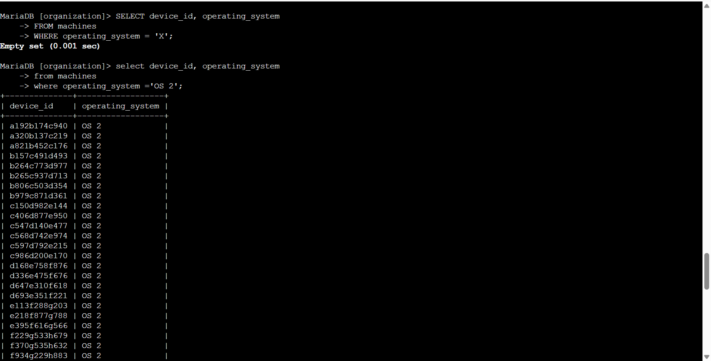
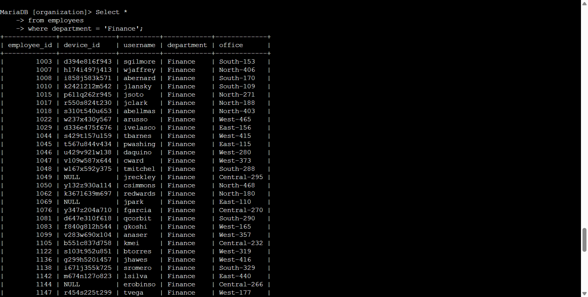
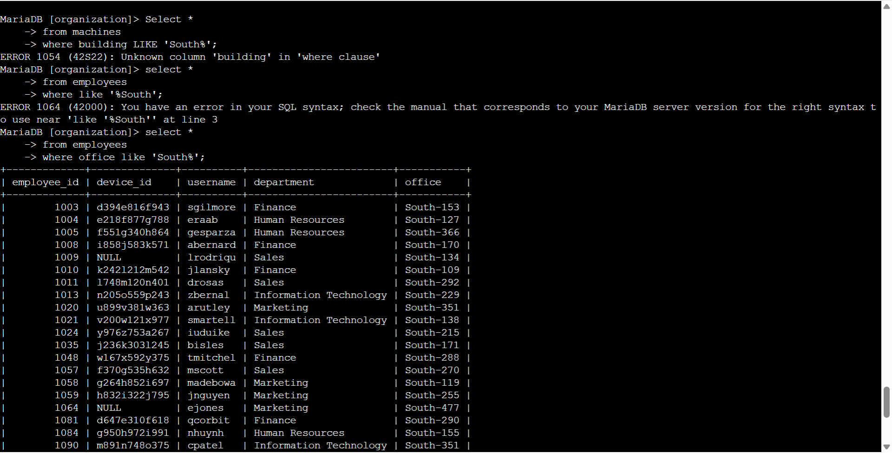

# SQL Filtering and Database Queries

## Overview

This project demonstrates hands-on SQL skills completed as part of the 
Google Cybersecurity Certificate.

The activity focused on using SQL queries to retrieve
specific information from a MariaDB database
and apply filters to database results.

## Skills Demonstrated

- SQL
- MariaDB
- SELECT statements
- WHERE clauses
- LIKE operator
- Database table inspection
- Filtering database records
- SQL troubleshooting
- Command-line database interaction

## Tasks Completed

### 1. Inspecting Database Tables

Used the 'DESCRIBE' command to examine the structure of the 'machines' and 'employees' tables.

This included identifying:

- Field names
- Data types
- Primary keys
- Nullable fields
- Table structure

### 2. Selecting Machine Information

Used a 'SELECT' statement to retrieve
specific fields from the 'machines' table, including device
IDs and operating systems.

### 3. Filtering by Operating System

Used a 'WHERE' clause to filter machine records 
based on the operating system.

Example:

### 4. Filtering Employees by Department

Queried the employees table and filtered results to display
employees belonging to the Finance department.

Example:

### 5. Using LIKE for Pattern Matching

Used the LIKE operator with a wildcard to identify employees whose office
location begins with 'South'.

Example:

# Troubleshooting

During the activity, I encountered SQL syntax
and column-name errors while constructing queries.
I reviewed the error messages, verified the database
table structure, and corrected the queries. This
strengthened my ability to troubleshoot SQL
queries and validate database fields before querying.

This demonstrated the importance of reading
SQL error messages and verifying database
fields before construction queries.

# Cybersecurity Relevance

SQL filtering is an important skill for cybersecurity professionals
because security analysts may need to query databases containing
information about users, devices, systems, and organizational
activity.

SQL can be used to help investigate:

- User accounts
- Devices and operating systems
- Department information
- System records
- Potentially suspicious activity

## Tools Used

- MariaDB
- SQL
- Linux command line
- Google Cybersecurity Certificate Lab
  environment

## Key Takeaway

This activity strengthened my ability to use SQL
to retrieve, filter, and investigate structured data
while troubleshooting query errors.

