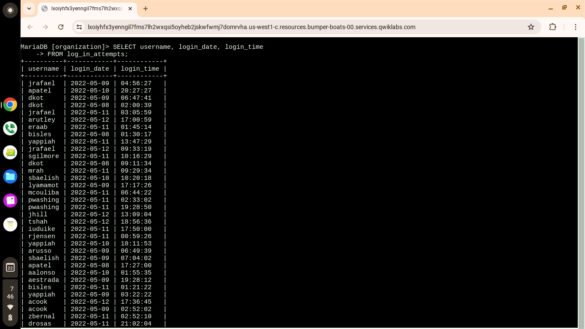
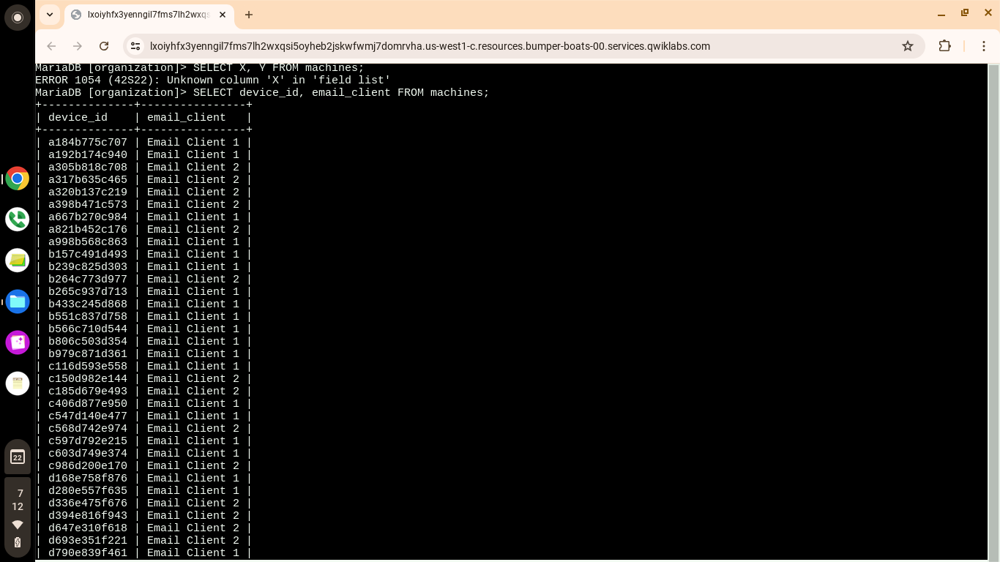
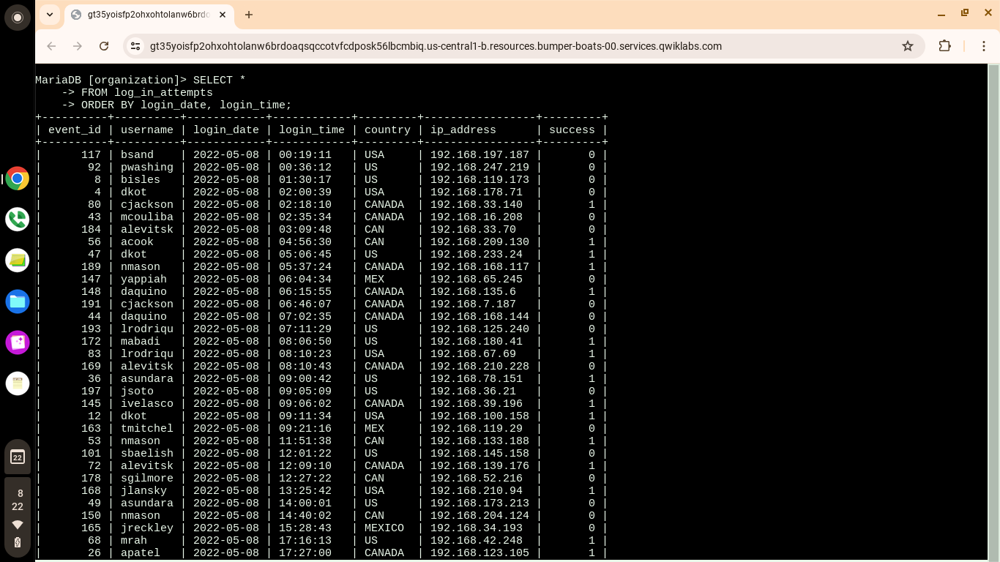
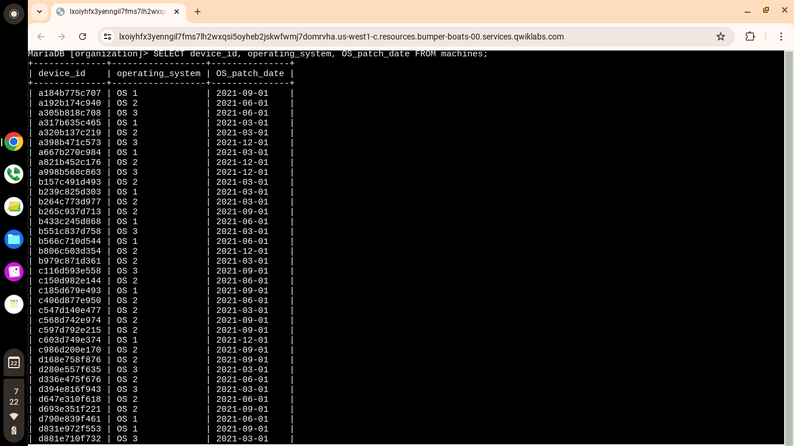
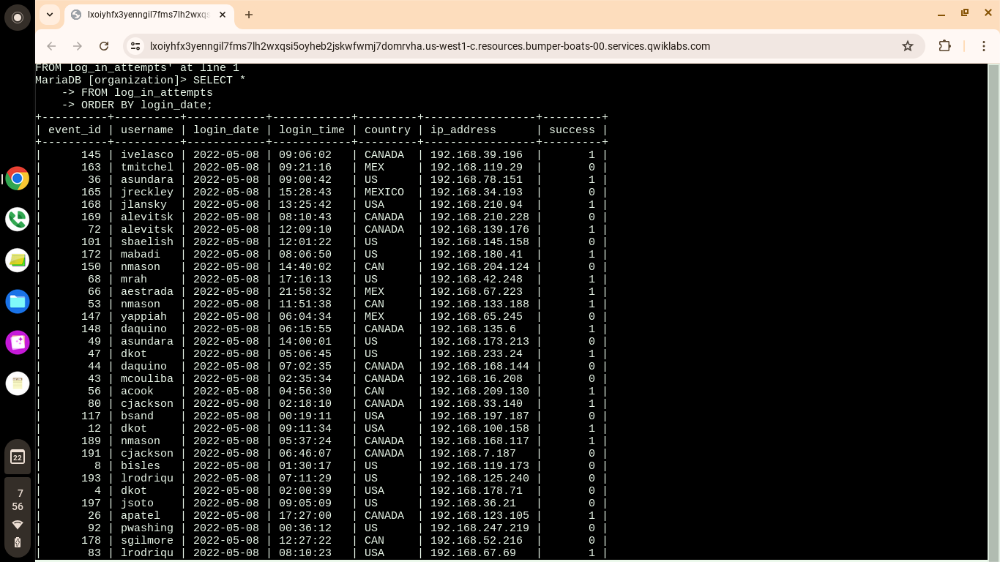
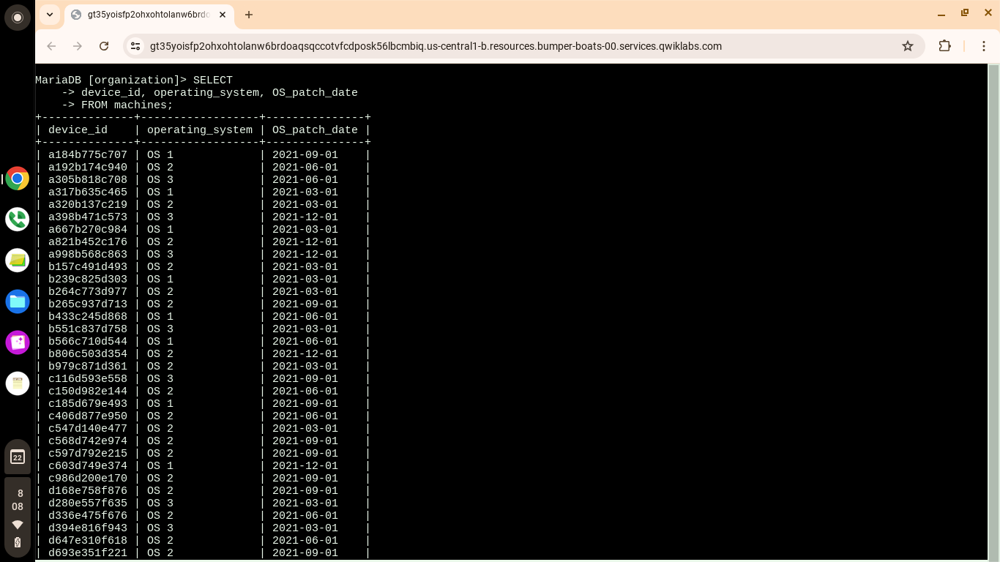
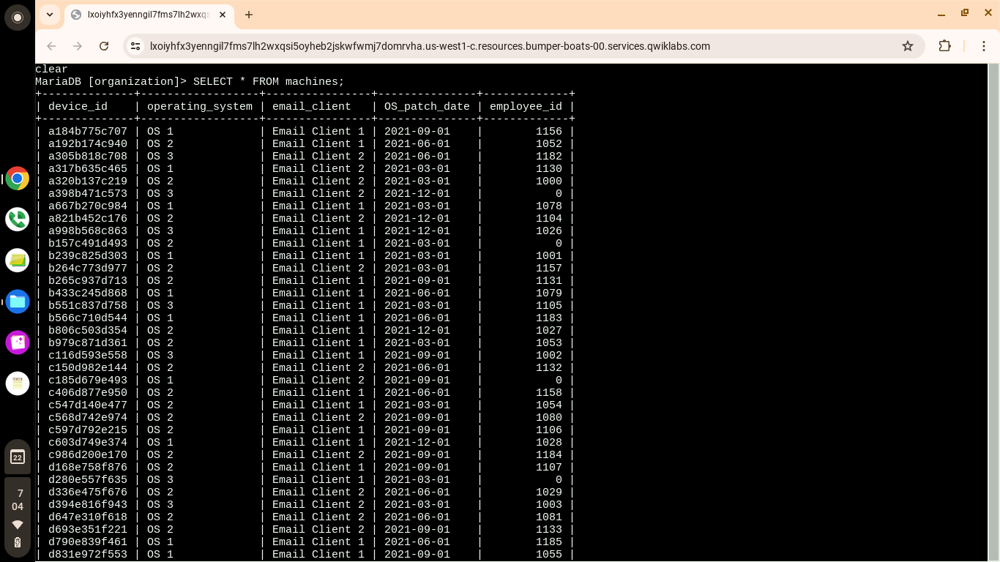
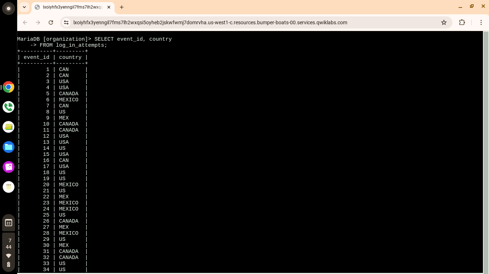
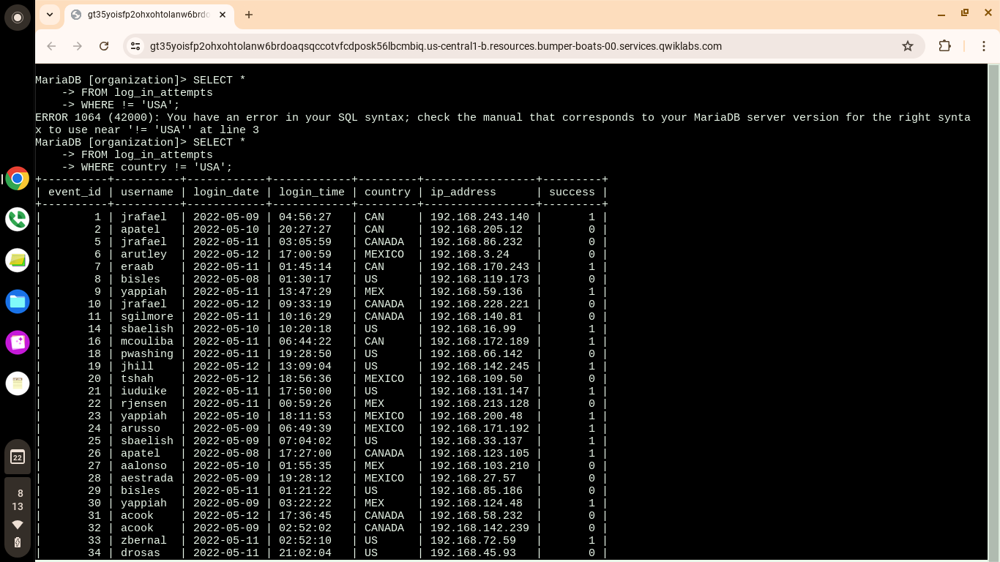

# SQL Security Investigation

## Overview

This project demonstrates my ability to use SQL to investigate security-related data stored in a relational database.

The activity was completed using the MariaDB shell and focused on retrieving, filtering, sorting, and analyzing information from database tables. The investigation included employee information, login attempts, and security-relevant database records.

This project demonstrates practical SQL skills that can be applied to security investigations, log analysis, and security operations.

---

## Objectives

- Retrieve information from database tables
- Investigate employee and organizational data
- Analyze login attempt records
- Filter results using SQL conditions
- Use multiple SQL queries to investigate data
- Sort query results
- Analyze security-relevant information
- Apply SQL concepts to cybersecurity investigations

---

## Skills Demonstrated

- SQL
- MariaDB
- Database Investigation
- Data Filtering
- Data Sorting
- WHERE Clauses
- ORDER BY
- Multiple-Query Analysis
- Security Log Analysis
- Cybersecurity Investigation

---

## Investigation Techniques

### Retrieving Database Information

Used SQL queries to retrieve specific information from database tables and understand the available security-related data.

### Filtering Results

Used `WHERE` conditions to narrow results and investigate specific records relevant to a security investigation.

### Sorting Results

Used `ORDER BY` to organize query results and make database information easier to analyze.

### Multiple Queries

Combined multiple SQL queries to investigate different aspects of the database and identify relevant information.

### Login Attempt Analysis

Queried login attempt data to examine authentication-related records and support security investigations.

---

## Evidence & Screenshots

The screenshots below document the SQL queries and results completed during the investigation.

### Checking Users

### Comma SQL Query

### Login Time Analysis

### Multiple SQL Queries

### ORDER BY Query

### Patch Date Query

### SQL Query

### Login Attempts

### WHERE Query

---

## Key Takeaways

This investigation strengthened my ability to use SQL as a cybersecurity analysis tool.

I practiced retrieving and filtering database information, analyzing login activity, sorting results, and using SQL queries to investigate security-relevant records.

These skills provide a foundation for working with security logs, databases, SIEM platforms, and other security operations tools.

---

## Tools Used

- MariaDB
- SQL
- Linux Terminal
- Cybersecurity Lab Environment

---

## Portfolio Context

This project is part of my cybersecurity portfolio and demonstrates hands-on experience applying technical skills to security-related investigations.
