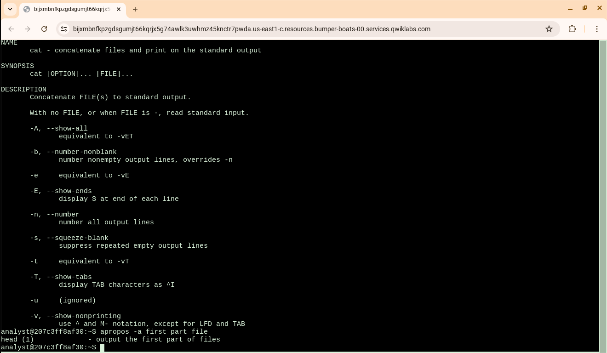
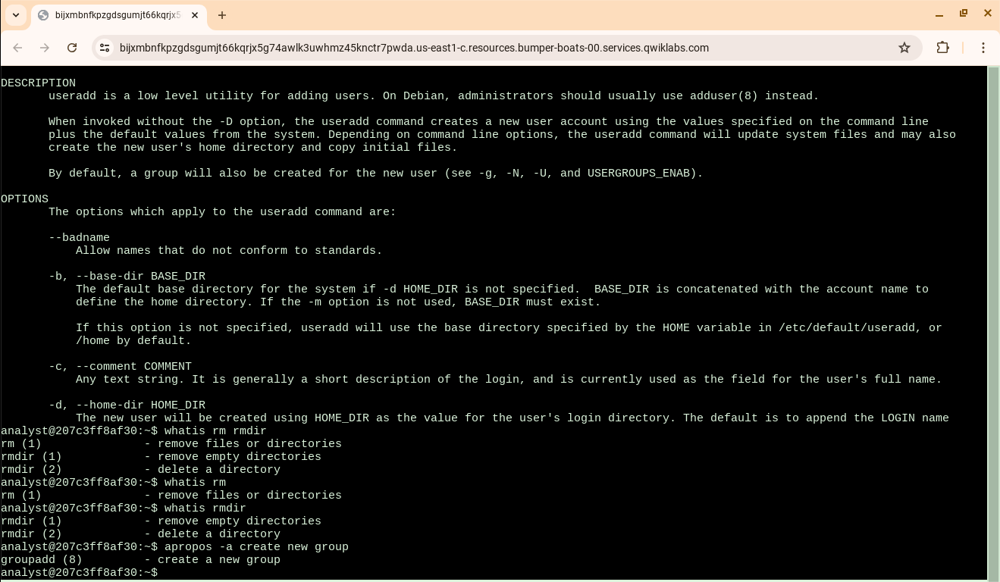
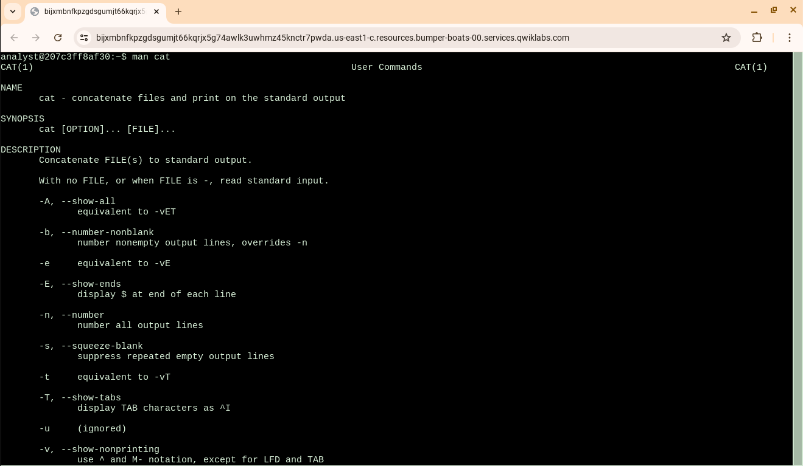
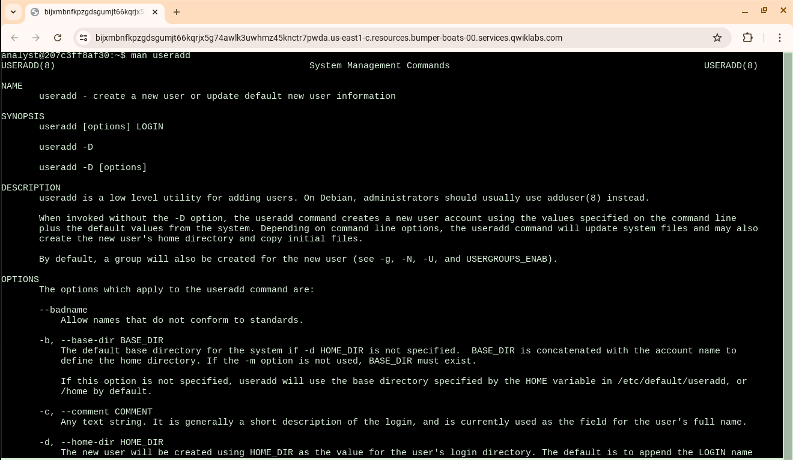
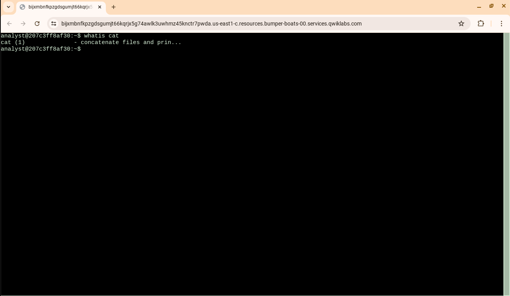
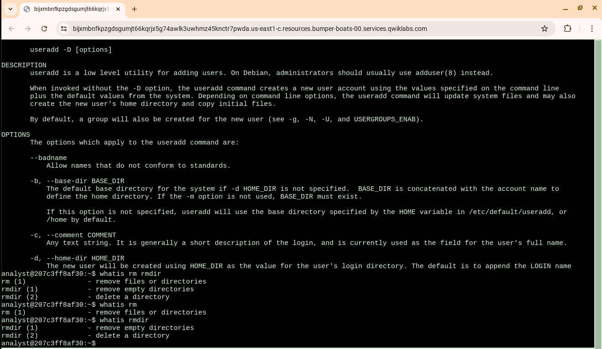

# Get Help in the Command Line

## Overview

This activity focused on using Linux command-line tools to find information about
commands and determine which commands are appropriate for specific tasks.

## Objective

Practice using Linux help and documentation commands to research command functionality
and identify the correct commands for security-related tasks.

## Commands Practiced

- 'man' - View detailed manual pages for Linux commands.
- 'whatis' - Display a brief description of a command.
- 'apropos' - Search manual page descriptions for keywords.

## What I Did

During this activity, I used the Linux Bash shell to:

- Explore commands that provide information about other Linux commands.
- Find and review command options.
- Compare the purpose and functionality of different commands.
- Research which command could be used to create a new group.

## Skills Demonstrated

- Linux command-line navigation
- Bash shell
- Linux command documentation
- Command-line research
- Troubleshooting and problem solving
- Security-focused Linux administration

## Security Relevance

Security analysts frequently work in Linux environments and need to quickly understand
unfamiliar commands, options, and system utilities. Knowing how to use built-in Linux
rather than relying entirely on external resources.

## Tools

- Linux
- Bash
- 'man'
- 'whatis'
- 'apropos'

## Evidence

### 'apropos' Command

The 'apropos' command was used to search available manual pages by keyword.

### 'apropos -a' Command

The 'apropos -a' command was used to perform a more specific manual-page search.

### 'man' Command

The 'man' command was used to access detailed Linux manual pages and learn how commands work.

### 'man useradd' Command

The 'man useradd' command was used to research the 'useradd' command and its available options.

### 'whatis' Command

The 'whatis' command was used to quickly find a brief description of a Linux command.

### 'whatis rm' and 'rmdir'

The 'whatis' command was used to compare the purpose of the 'rm' and 'rmdir' commands.

Screenshots documenting the completed activity are included in this project.

## Key Takeaway

This activity strengthened my ability to independently research Linux commands from
the command line. These skills are useful when working with Linux systems during
security monitoring, investigation, administration, and troubleshooting.
