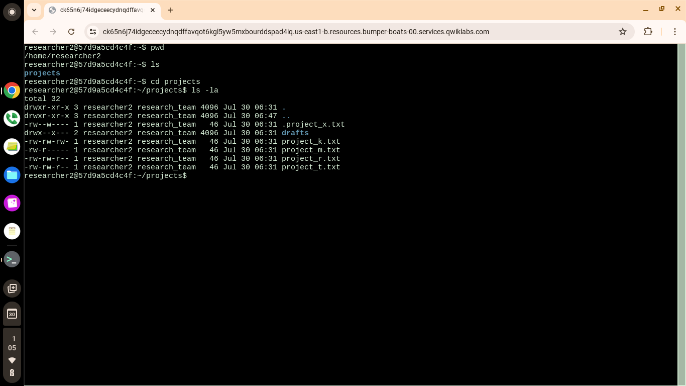
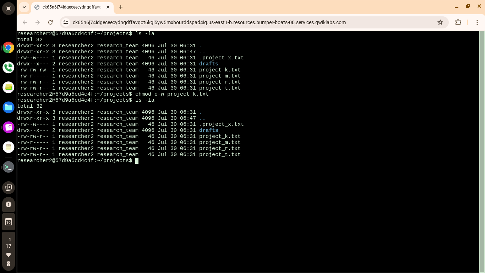
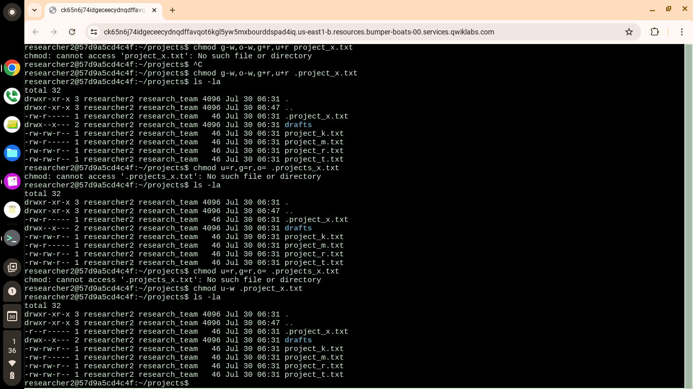
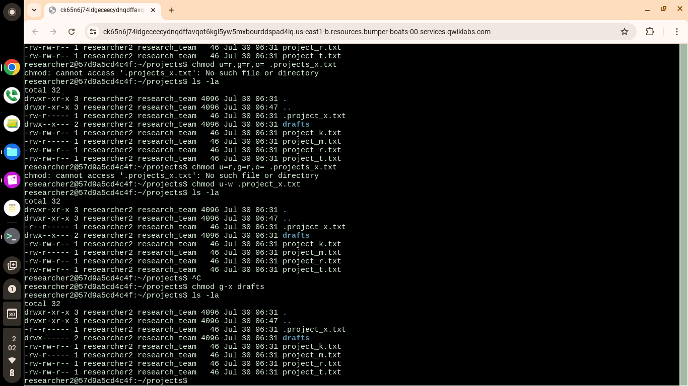

# Linux File Permissions Management

## Project Overview

This project demonstrates my ability to inspect, interpret, and modify Linux file and directory permissions using Bash commands. The objective was to secure files and directories by applying the Principle of Least Privilege, ensuring users only have the permissions necessary to perform their tasks.

This project was completed as part of the Google Cybersecurity Professional Certificate.

---

## Scenario

A research team stored several project files with incorrect permissions. My task was to review existing permissions and modify them to improve security while maintaining authorized access.

The project included:

- Reviewing file permissions
- Understanding Linux permission strings
- Removing unnecessary write permissions
- Securing hidden files
- Restricting access to sensitive directories

---

## Tools Used

- Linux
- Bash
- chmod
- ls -la
- Terminal

---

## Skills Demonstrated

- Linux Administration
- Bash
- File Permissions
- Access Control
- Principle of Least Privilege
- Security Hardening
- Command Line
- Cybersecurity Fundamentals

---

## Commands Used

### View files and permissions

```bash
ls -la
```

### Remove write permission from others

```bash
chmod o-w project_k.txt
```

### Modify permissions on a hidden file

```bash
chmod g-w,o-w,g+r,u+r .project_x.txt
```

### Restrict access to the drafts directory

```bash
chmod g-x drafts
```

---

## Screenshots

### Initial Permissions

Add your first screenshot here.

```
images/01-before-permissions.png
```

---

### Removing Write Permissions

Add your second screenshot here.

```
images/02-remove-write.png
```

---

### Hidden File Permissions

Add your third screenshot here.

```
images/03-hidden-file.png
```

---

### Final Permissions

Add your final screenshot here.

```
images/04-final-permissions.png
```

---

## What I Learned

Through this project I learned how Linux uses permission strings to control access to files and directories. I practiced using the `ls -la` command to inspect permissions and the `chmod` command to securely modify them.

This project reinforced the Principle of Least Privilege by removing unnecessary permissions while ensuring authorized users retained the access they needed.

---

## Author

**Sarah Flores (CipherTrail)**

Google Cybersecurity Professional Certificate Student


## Evidence / Screenshots

### Initial File Permissions


### Write Permission Removed


### Hidden File


### Final File Permissions

