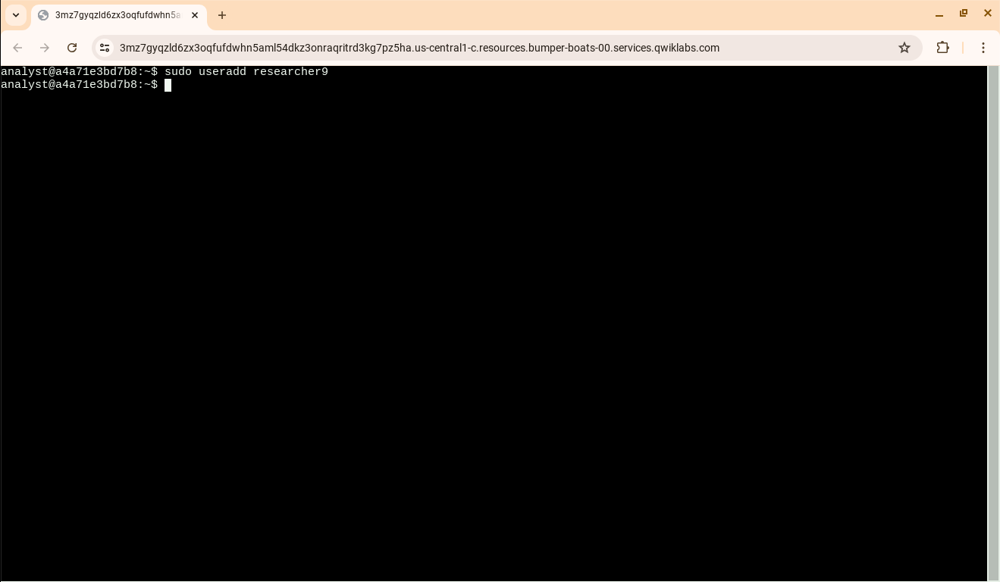
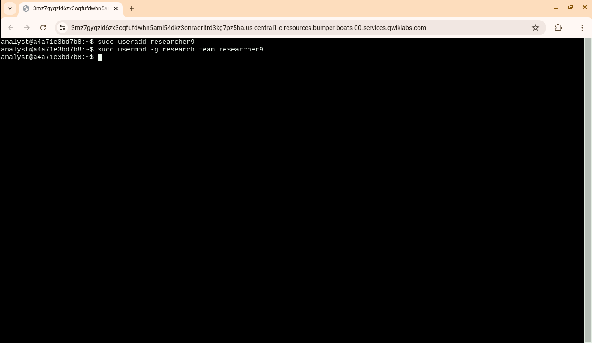
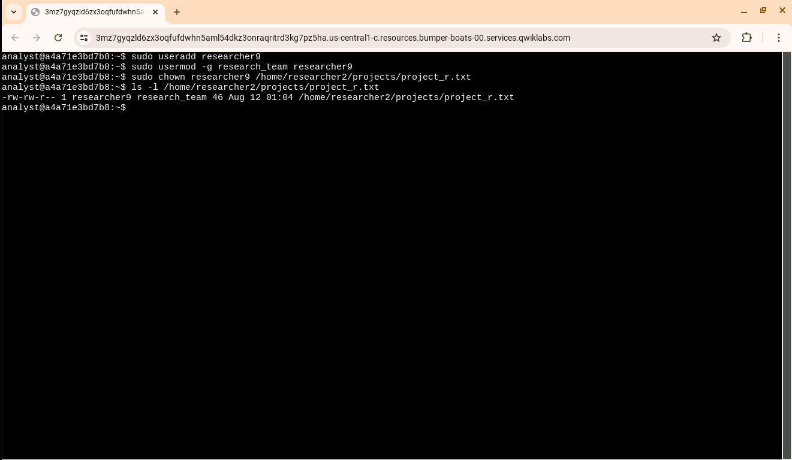
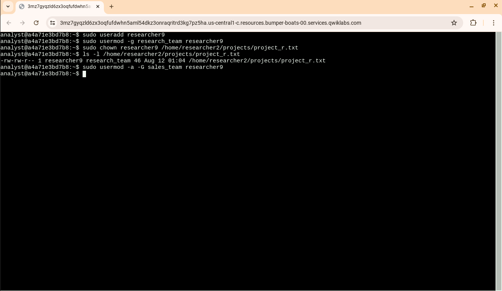
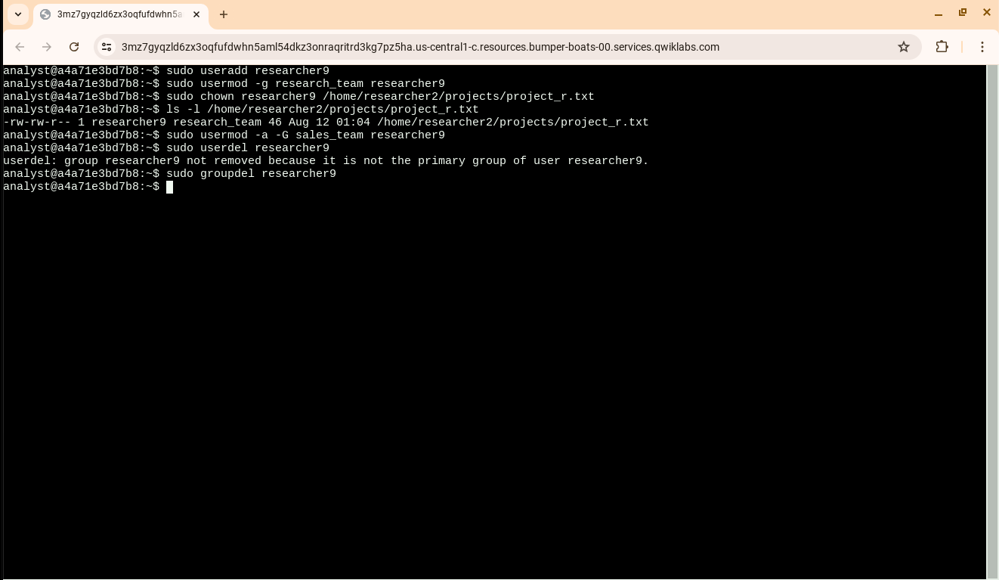

# Linux User Management & Access Control

## Overview

This hands-on lab was completed as part of the **Google Cybersecurity Certificate**. The activity focused on managing Linux users, groups, file ownership, and access using Bash commands.

The lab simulated common administrative and security tasks that an analyst or system administrator may perform when managing access to resources in a Linux environment.

## Objectives

* Create and manage Linux user accounts
* Manage primary and secondary group membership
* Change file ownership
* Verify file ownership and permissions
* Remove users and groups
* Apply Linux command-line skills to access control

## Skills Demonstrated

* Linux user administration
* Bash command-line usage
* User and group management
* File ownership
* Access control
* Authentication and authorization concepts
* Principle of least privilege
* Account lifecycle management

## Tools & Environment

* Linux
* Bash shell
* Google Cloud Skills Boost / Qwiklabs environment
* Google Cybersecurity Certificate

---

## Hands-On Tasks

### 1. Create a Linux User

```bash
sudo useradd researcher9
```

Created a new Linux user account named `researcher9`.

**Security relevance:**
Individual user accounts allow organizations to identify and manage access for specific users instead of relying on shared accounts.

**Evidence:**



---

### 2. Add the User to a Group

```bash
sudo usermod -g research_team researcher9
```

Assigned `researcher9` to the `research_team` group.

**Security relevance:**
Linux groups allow access to be managed according to roles or responsibilities. This supports structured access control and can help organizations apply the principle of least privilege.

**Evidence:**



---

### 3. Change File Ownership

```bash
sudo chown researcher9 /home/researcher2/projects/project_r.txt
```

Changed the ownership of `project_r.txt` to `researcher9`.

**Security relevance:**
File ownership determines which user is associated with a resource. Proper ownership helps ensure that sensitive files are controlled by the appropriate account.

**Evidence:**



---

### 4. Verify File Ownership and Permissions

```bash
ls -l /home/researcher2/projects/project_r.txt
```

Used the `ls -l` command to inspect the file's permissions, owner, and group.

The output showed:

* Owner: `researcher9`
* Group: `research_team`

**Security relevance:**
Security analysts and system administrators can use permission and ownership information when investigating whether access to files is configured appropriately.

**Evidence:**


---

### 5. Add a Secondary Group

```bash
sudo usermod -a -G sales_team researcher9
```

Added `researcher9` to the `sales_team` group as a secondary group.

**Security relevance:**
Secondary groups can provide additional access to resources. Group membership should be reviewed regularly because unnecessary group privileges can increase the risk of unauthorized access.

**Evidence:**



---

### 6. Remove a User and Group

```bash
sudo userdel researcher9
```

Attempted to remove the `researcher9` user account.

The system indicated that the user could not be removed because the group was still the user's primary group.

The associated group was then removed:

```bash
sudo groupdel researcher9
```

**Security relevance:**
Removing unused accounts and associated groups is an important part of account lifecycle management. Organizations should disable or remove accounts when they are no longer needed to reduce unnecessary access.

**Evidence:**



---

## Key Cybersecurity Concepts

### Authentication

User accounts provide a way for a system to distinguish between individual users.

### Authorization

Groups, permissions, ownership, and access controls determine what users are allowed to access.

### Least Privilege

Users should receive only the access necessary to perform their responsibilities.

### Account Lifecycle Management

Creating, modifying, and removing accounts are all important parts of securely managing user access.

### Access Control

Linux permissions, ownership, and group membership provide mechanisms for controlling access to system resources.

---

## What I Learned

This lab gave me hands-on experience managing Linux users and groups through the Bash command line. I practiced creating accounts, assigning group membership, changing file ownership, verifying permissions, and removing accounts.

One of the most important lessons was that **user management and file permissions work together to control access to system resources**.

I also encountered a situation where a user could not immediately be removed because of its relationship with a primary group. This demonstrated that Linux account and group relationships need to be understood before making administrative changes.

## Cybersecurity Takeaways

This activity reinforced that access control is a fundamental part of cybersecurity.

Properly managing users, groups, ownership, and permissions can help organizations:

* Prevent unauthorized access
* Limit unnecessary privileges
* Protect sensitive files
* Maintain accountability for user activity
* Reduce security risks from unused accounts

## Evidence

The screenshots included in this project document the commands and results from the completed hands-on lab.

## Lab Status

**Completed**

**Course:** Google Cybersecurity Certificate

**Focus:** Linux User Management & Access Control
